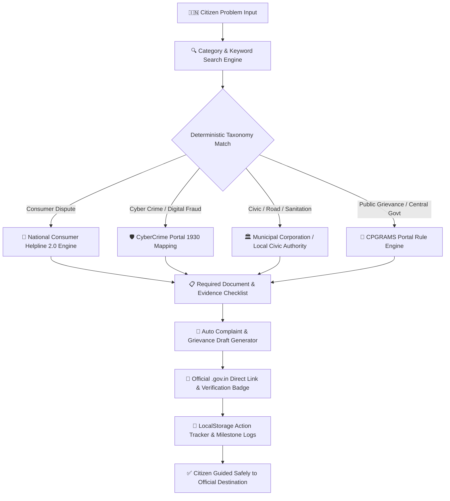

# 

<div align="center">

# NyayaSetu (न्यायसेतु)
### India’s Citizen Action & Government Navigation Engine — Built for Real Indian Citizens

*No more portal confusion. No more scam websites. Just clear, step-by-step guidance to official government services.*

[](https://developer.mozilla.org/)
[](https://developer.mozilla.org/en-US/docs/Web/API/Window/localStorage)
[]()
[](https://techtomorrow.in)
[]()
[](./LICENSE)

**NyayaSetu** is an independent, citizen-focused web application designed to eliminate confusion around everyday public-service issues in India. Engineered to solve the friction citizens face when dealing with public grievances, scam portals, and complex documentation requirements, NyayaSetu acts as an intuitive guidance layer directing citizens straight to official government departments with actionable step-by-step resolution plans.

[What is NyayaSetu?](#-what-is-nyayasetu-in-one-line) • [The Real Problem](#-why-does-this-exist-the-real-problem) • [Architecture Flowchart](#-system-architecture-flowchart) • [Page & Component Inventory](#-page--component-inventory) • [Design System](#-uiux-design-system) • [Core Engine & Data Models](#-core-engine--data-models) • [Government Rulebook](#-government-portal-policy--safety-boundaries) • [7-Day Roadmap](#-7-day-implementation-roadmap) • [Official References](#-official-government-reference-set) • [Team](#-team-sankalp-tech-tomorrow-interns)

---

</div>

## 💡 What is NyayaSetu, in one line?

> **NyayaSetu is an independent citizen-navigation engine that guides everyday Indians to the correct official government authority, required document checklist, formal complaint draft, and step-by-step action plan for any public service issue.**

Whether dealing with an e-commerce refund dispute, delayed cyber fraud reporting, municipal sanitation issues, or passport document confusion—NyayaSetu guides citizens to the exact official portal (National Consumer Helpline, CPGRAMS, CyberCrime.gov.in, myScheme) without fake intermediate sites, agent middleman fees, or misleading copycat domains.

---

## 🎯 Why does this exist? (The Real Problem)

The project is not based on the assumption that government services are absent in India. It is based on a **usability and guidance problem**:

1. **Portal Confusion & Scam Sites**: Search engines regularly rank unofficial third-party portals, paid agent sites, and fraudulent copycat links above actual official government portals (e.g., CPGRAMS, NCH).
2. **Missing Document Readiness**: Citizens travel to government offices or submit online grievances only to get rejected due to a single missing document or incorrect proof format.
3. **Complex Administrative Jargon**: Official grievance guidelines are written in complex administrative language that is intimidating for non-legal backgrounds.
4. **Zero Grievance Tracking**: People file complaints but lose track of reference numbers, timelines, or follow-up procedures, leading to abandoned complaints.

**NyayaSetu solves this at the root**: *A clean, step-by-step decision tree that empowers citizens with exact action blueprints before they file on official portals.*

---

## 🧠 System Architecture Flowchart

NyayaSetu decouples **Problem Discovery & Classification** from **Action Blueprint & Complaint Generation**, ensuring that citizens receive custom, verified guidance before reaching official portals.



---

## 📑 Page & Component Inventory

The MVP consists of focused, high-impact pages designed for seamless navigation:

| Page | URL Path | Core Responsibility |
| :--- | :--- | :--- |
| **Home** | `/index.html` | Hero search, top issue categories, emergency helpline quick bar, transparency disclaimers. |
| **About Us** | `/about-us.html` | Product vision, team credits (Team Sankalp), Why NyayaSetu feature cards. |
| **Track** | `/pricing.html` | Local Action Tracker for reference IDs, filing dates, and local storage progress notes. |
| **Action Guide** | `/service.html` | Categorized action guides, multi-filters, step-by-step escalation procedures. |
| **Categories** | `/project.html` | 8 verified public action categories with official department maps. |
| **Updates** | `/blog-post.html` | Verified citizen guides, document prep checklists, and CPGRAMS updates. |
| **Contact** | `/contact.html` | Guidance helpdesk form and Team Sankalp contact details. |

---

## 🎨 UI/UX Design System

NyayaSetu enforces a clean, government-service-inspired visual language with modern product polish:

- 🟢 **Color Palette**: Pristine White (`#FFFFFF`), Soft Mint Backgrounds (`#F7FCF8`), Emerald Primary Accents (`#2F855A` / `#57B26A`), Deep Slate High-Contrast Typography (`#1F2937`).
- 📐 **Radius & Shadows**: Generous 12–20px corner radii, subtle elevation shadows, clean borders (`#EEF7F0`).
- 🚫 **Design Rules**: No dark mode for MVP, no neon colors, no over-saturated gradients, no AI-generated visual clutter.

---

## 🛡️ Government Portal Policy & Safety Boundaries

NyayaSetu is strictly built as an **independent guidance layer**. To preserve 100% integrity and trust:

1. ❌ **Never Impersonate**: Does not copy official government emblems, logos, or headers.
2. ❌ **Zero Credential Collection**: Never asks for Aadhaar passwords, PAN numbers, OTPs, or bank PINs.
3. ❌ **No Identity Uploads**: Does not request identity document uploads in the MVP.
4. ❌ **No Fake API Claims**: Does not claim to automatically file grievances into government servers.
5. ✅ **Verified Official Sources Only**: Directs users strictly to verified `.gov.in` and official government portals.
6. ✅ **Clear Transparency Disclaimer**: Explicitly displays transparency badges: *"NyayaSetu is an independent citizen guidance initiative by Team Sankalp — Tech Tomorrow."*

---

## 📅 7-Day Implementation Roadmap

| Phase | Focus Area | Deliverables |
| :--- | :--- | :--- |
| **Day 1** | Planning & Git Setup | System architecture, category taxonomy, Git repo & branch strategy. |
| **Day 2** | Homepage & Discovery | Citizen-friendly landing page, search bar, and problem category grid. |
| **Day 3** | Multi-Step Decision Tree | Dynamic questionnaire flow for matching problem to authority. |
| **Day 4** | Rules Engine & Portal Mapping | Department lookup database with official `.gov.in` links. |
| **Day 5** | Draft Generator & Checklist | Auto-filling complaint template and document checklist engine. |
| **Day 6** | LocalStorage Tracker & UI | Complaint history tracker, responsive CSS, and mobile optimization. |
| **Day 7** | Testing & Final Release | End-to-end testing, documentation, live deployment, and demo report. |

---

## 🏛️ Official Government Reference Set

NyayaSetu references official government systems as verified destination sources:

- 📩 **CPGRAMS** — Centralized Public Grievance Redress and Monitoring System  
  👉 Portal: [https://pgportal.gov.in/](https://pgportal.gov.in/)  
  *Scope: Public grievance lodging, status tracking, reminders, and appeals.*

- 💡 **myScheme** — National Government Scheme Discovery Platform  
  👉 Portal: [https://www.myscheme.gov.in/](https://www.myscheme.gov.in/)  
  *Scope: Central and state government scheme search and eligibility guidance.*

- 🛒 **National Consumer Helpline (NCH 2.0)**  
  👉 Portal: [https://consumerhelpline.gov.in/](https://consumerhelpline.gov.in/) | National Toll-Free: `1915`  
  *Scope: Consumer rights, e-commerce disputes, and merchant grievances.*

- 🛡️ **National Cyber Crime Reporting Portal**  
  👉 Portal: [https://cybercrime.gov.in/](https://cybercrime.gov.in/) | Emergency Helpline: `1930`  
  *Scope: Financial fraud, cyber crime reporting, and account freezing assistance.*

---

## 🎙️ 60-Second Project Pitch

> *“NyayaSetu is an independent citizen-action guide built by Team Sankalp under Tech Tomorrow. We noticed that the challenge is often not the absence of a government service, but the difficulty of knowing the right next step. NyayaSetu lets citizens describe a problem, answer a few simple questions, map the situation to a curated authority, show the documents or evidence to prepare, help draft the request, and keep a local tracking record. The MVP is built entirely with HTML, CSS, and JavaScript, uses verified official `.gov.in` links, avoids collecting sensitive credentials, and deliberately stays separate from government portals. Our goal is simple: make the path to the right official action easier to understand.”*

---

## 📦 Getting Started (Running It Yourself)

### 1. Clone the Repository
```bash
git clone https://github.com/mohitraj8503/Nyaya-Setu.git
cd Nyaya-Setu
```

### 2. Run Locally
Since NyayaSetu is built with pure HTML5, CSS3, and JavaScript, no complex Node build step is required! Simply open `index.html` in your browser:

- **Option A (VS Code Live Server)**: Right-click `index.html` -> `Open with Live Server`.
- **Option B (Direct Browser)**: Double-click `index.html` or drag it into any web browser.

---

## 👥 Team Sankalp (Tech Tomorrow Web Development Interns)

NyayaSetu was designed, architected, and built by **Team Sankalp** under the guidance of **Tech Tomorrow**:

- 👨💻 **Ranjan Singh** — *Web Development Intern*
- 👨💻 **Om Prabhat** — *Web Development Intern*
- 👨💻 **Nitin Sinha** — *Web Development Intern*
- 👨💻 **Keshav Ruhela** — *Web Development Intern*

**Mentor & Supervision**: **Mohit Raj** (*Mentor — Web Development Internship, Tech Tomorrow*)

---

<div align="center">

**Learn Today • Build Responsibly • Lead Tomorrow**  
© 2026 Tech Tomorrow Pvt. Ltd. All Rights Reserved.

</div>
